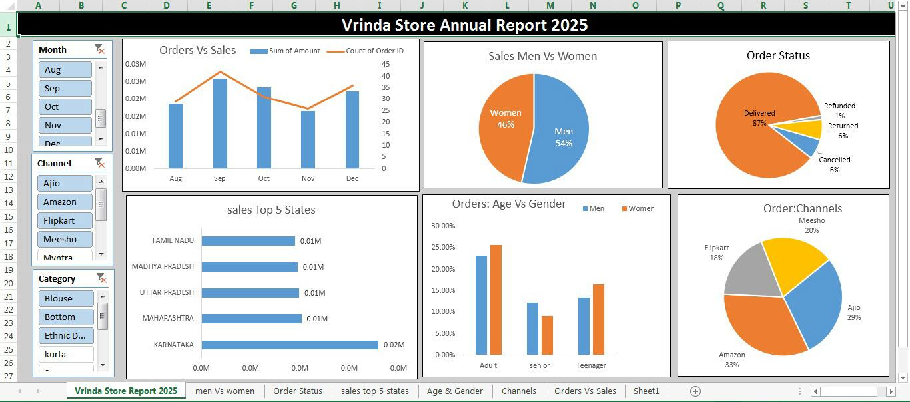

Annual Sales Report 2022 – Vrinda Store

Description & Purpose

Vrinda Store wants to create an “annual sales report for 2022” to better understand their customers and improve sales in 2023.  
The report analyzes sales data, order patterns, customer demographics, and channel performance to derive actionable insights for business growth.

Tech / Data Sours

Microsoft Excel: For data entry, calculations, pivot tables, and charts  
Excel Dashboard Features: Slicers, dynamic charts, and interactive visuals  
Data Source: Sales dataset from [Rishabh Mishra YouTube Channel] (https://www.youtube.com/@RishabhMishra)

Features / Highlights

Compare “sales and orders” using a single chart  
Identify the “month with highest sales and orders”
Analyze “customer demographics” : who purchased more (men or women)  
Explore “different order statuses” in 2022  
List “top 10 states contributing to sales”  
Examine “relation between age and gender “based on number of orders  
Identify which “sales channels” are contributing most  
Determine the “highest selling category”
Provide actionable “insights and recommendations” for marketing and sales strategies  

Sample Insights

“Women” are more likely to buy compared to men (65%)  
“Top contributing states”: Maharashtra, Karnataka, Uttar Pradesh (35%)  
“Adult age group (30-49 yrs)” contributes most to sales (50%)  
“Top channels”: Amazon, Flipkart, and Myntra (80%)  

Final Conclusion / Recommendations

To improve Vrinda Store sales:  
“Target women customers” aged “30-49 yrs” living in “Maharashtra, Karnataka, and Uttar Pradesh”
Use “ads, offers, and coupons” on “Amazon, Flipkart, and Myntra” to maximize sales potential
## 📊 Dashboard Preview

  
Figure: Interactive Excel dashboard showing sales trends

 "Exploring data today to empower decisions tomorrow."

